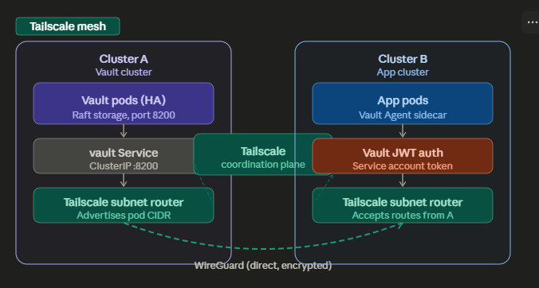

# vault-tailscale

A working proof-of-concept of **cross-cluster secret retrieval** over a
[Tailscale](https://tailscale.com) mesh:

- **Cluster A** runs **HashiCorp Vault** (HA + Raft, kv-v2 secrets engine).
- **Cluster B** runs a tiny Go service that fetches credentials from Vault
  via a **Vault Agent sidecar**.
- The two clusters share **no IP space** and have **no direct API access** to
  each other. The app's only path to Vault is a **WireGuard tunnel** managed
  by Tailscale.
- The app **never holds a long-lived Vault token**. It authenticates each
  pod with a short-lived Kubernetes **ServiceAccount JWT** (audience `vault`),
  validated **offline** by Vault using Cluster B's public keys.



---

## Table of contents

- [Architecture](#architecture)
- [Repository layout](#repository-layout)
- [Prerequisites](#prerequisites)
- [Setup](#setup)
- [Testing](#testing)
- [Results](#results)
- [Known limitations](#known-limitations-poc-scope)
- [Production hardening](#production-hardening)

---

## Architecture

| Cluster | Workloads | Tailscale role |
|---|---|---|
| **A — Vault** | `vault-0` (Raft, single replica for the POC) | `vault-tailscale-proxy` Deployment in `tailscale` namespace — joins the tailnet as `vault-cluster-a`, `TS_DEST_IP` forwards inbound traffic to the Vault Service ClusterIP. |
| **B — App** | `vault-consumer` pod with 3 containers: `tailscale` sidecar, `vault-agent`, and `app` | Tailscale runs as a **sidecar** inside the app pod, joining the tailnet as `app-cluster-b`. The whole pod's network namespace sees the tailnet. |

Request flow:

```
app container (Cluster B pod)
  └─► reads /vault/secrets/credentials  (file rendered by sidecar)

vault-agent container (same pod, shared network ns)
  └─► HTTP GET http://vault-cluster-a:8200/v1/secret/data/app/credentials
        │  ↑ MagicDNS resolved via Tailscale sidecar (--accept-dns=true)
        ▼
tailscale sidecar (same pod)
  └─► direct WireGuard tunnel
        ▼
vault-tailscale-proxy pod (Cluster A, tailscale ns)
  └─► TS_DEST_IP=<Vault ClusterIP>:8200
        ▼
vault-0 pod (Cluster A, vault ns)
  └─► validates JWT offline against Cluster B's PEM pubkeys
       bound_audiences=[vault]
       bound_subject=system:serviceaccount:app:vault-consumer
  └─► returns kv-v2 secret
```

For deeper notes on each layer, see:

- [`docs/architecture.md`](docs/architecture.md) — design rationale.
- [`docs/tailscale-setup.md`](docs/tailscale-setup.md) — Tailscale wiring,
  ACL examples, when to graduate to the Tailscale Kubernetes Operator.
- [`docs/vault-jwt-auth.md`](docs/vault-jwt-auth.md) — how Vault validates
  Cluster B SA tokens without TokenReview cross-cluster API access.

## Repository layout

```
app/                 Go service + Vault Agent sidecar + Tailscale sidecar (Cluster B)
  ├── main.go        Reads /vault/secrets/credentials, logs every 15 s, serves /healthz + /creds
  ├── Dockerfile     For reference; this POC ships the binary directly via hostPath
  └── k8s/           ServiceAccount, RBAC, ConfigMap (agent.hcl), Deployment

vault/               Cluster A — Vault server config
  ├── helm-values.yaml      ha.replicas: 1, Raft storage, TLS disabled (POC)
  ├── policies/app-read.hcl Path-based policy for the app role
  └── bootstrap/            init-unseal.sh + configure-auth.sh (JWKS → PEM, role)

tailscale/           Cluster A — egress proxy that exposes Vault on the tailnet
  └── cluster-a-router.yaml  Deployment with init container resolving Vault's ClusterIP

scripts/             Numbered runbook + helpers
  ├── 00-setup-kubeconfigs.sh   Pull kubeconfigs out of iximiuz, start port-forwards
  ├── 01-bootstrap-cluster-a.sh Install + init + unseal + JWT auth
  ├── 02-bootstrap-cluster-b.sh Build Go binary, ship to node, apply app manifests
  ├── 03-wire-tailscale.sh      Deploy egress proxy on Cluster A
  ├── 99-verify.sh              End-to-end smoke test
  ├── build-kubeconfig.sh       Merge KUBECONFIG_A + KUBECONFIG_B → .kubeconfig
  └── monitor.sh                Launch k9s with both clusters loaded

docs/                Long-form design + ops notes
images/overview.png  Architecture diagram
```

## Prerequisites

| Tool | Why |
|---|---|
| `kubectl` (≥ 1.29), `helm` (≥ 3.14) | Standard. |
| `jq`, `curl`, `python3` (with `cryptography`) | JSON munging, JWKS → PEM conversion. |
| `go` (≥ 1.22) | Build a static Linux binary locally; no Docker required. |
| `labctl` ([install](https://labs.iximiuz.com/cli)) | For iximiuz playgrounds — feel free to substitute kind/minikube and skip script `00`. |
| Tailscale tailnet + auth key | Free tier covers it. Generate at <https://login.tailscale.com/admin/settings/keys>: **Reusable** ✅ + **Ephemeral** ✅, tag `tag:k8s-router`. |
| k9s (optional) | Multi-cluster TUI — `bash scripts/monitor.sh` launches it. |

A Python virtualenv with `cryptography` if your system Python lacks it:

```bash
python3 -m venv .venv && . .venv/bin/activate && pip install cryptography
```

## Setup

```bash
# 0. Two iximiuz playgrounds.
labctl playground start k3s-bare      # -> PLAY_A
labctl playground start k3s-bare      # -> PLAY_B

# 1. Fill .env with TS_AUTHKEY, PLAY_A, PLAY_B (copy from .env.example).
cp .env.example .env
$EDITOR .env
set -a; source .env; set +a

# 2. Pull both kubeconfigs out of the playgrounds and open API port-forwards.
#    Cluster A on 127.0.0.1:6443, Cluster B on 127.0.0.1:6444.
bash scripts/00-setup-kubeconfigs.sh
set -a; source .env; set +a              # re-source: script writes KUBECONFIG_A/B back

# 3. Vault on Cluster A: install, init, unseal, configure JWT auth for Cluster B.
bash scripts/01-bootstrap-cluster-a.sh

# 4. Tailscale egress proxy on Cluster A (exposes Vault on the tailnet).
#    Writes VAULT_TAILNET_HOST back to .env (the actual hostname Tailscale
#    assigned, which may differ from `vault-cluster-a` if a stale ephemeral
#    device of the same name is still registered — see Known limitations).
bash scripts/03-wire-tailscale.sh
set -a; source .env; set +a              # pick up VAULT_TAILNET_HOST

# 5. App on Cluster B: build static Go binary, ship to k3s node, apply manifests.
bash scripts/02-bootstrap-cluster-b.sh

# 6. Verify end-to-end.
bash scripts/99-verify.sh
```

Optional — for multi-cluster monitoring in a TUI:

```bash
bash scripts/build-kubeconfig.sh        # merges into ./.kubeconfig (gitignored)
bash scripts/monitor.sh                 # opens k9s; switch contexts with :ctx
```

## Testing

### 1. Happy-path smoke test

```bash
bash scripts/99-verify.sh
```

This:

- Confirms the app pod is `3/3 Ready`.
- Reads `/vault/secrets/credentials` from inside the pod.
- Tails the app's stdout (which prints the credentials every 15 s).
- `curl`s the `/creds` HTTP endpoint via `kubectl port-forward`.

### 2. Cross-cluster auth status

```bash
set -a; source .env; set +a

# Vault is healthy + unsealed, has the role + secret + kv mount.
KUBECONFIG=$KUBECONFIG_A kubectl -n vault exec vault-0 -- vault status
KUBECONFIG=$KUBECONFIG_A kubectl -n vault exec vault-0 -- \
  env VAULT_TOKEN=$(jq -r .root_token .vault-init.json) \
  vault read auth/jwt-cluster-b/role/app

# Both Tailscale peers can see each other.
KUBECONFIG=$KUBECONFIG_A kubectl -n tailscale exec deploy/vault-tailscale-proxy -- tailscale status
POD=$(KUBECONFIG=$KUBECONFIG_B kubectl -n app get pod -l app=vault-consumer -o jsonpath='{.items[0].metadata.name}')
KUBECONFIG=$KUBECONFIG_B kubectl -n app exec $POD -c tailscale -- tailscale status
```

### 3. Live secret rotation

Prove that updates in Vault flow through to the app without a restart:

```bash
KUBECONFIG=$KUBECONFIG_A kubectl -n vault exec vault-0 -- \
  env VAULT_TOKEN=$(jq -r .root_token .vault-init.json) \
  vault kv put secret/app/credentials \
    username=poc-user-v2 \
    password=rotated-$(date +%s)

# The agent re-renders within static_secret_render_interval (default 5m).
# To shorten, set `template_config { static_secret_render_interval = "10s" }` in agent.hcl.
# Otherwise force an immediate re-render by killing the agent process:
KUBECONFIG=$KUBECONFIG_B kubectl -n app exec $POD -c vault-agent -- /bin/sh -c 'kill 1' || true
sleep 10
KUBECONFIG=$KUBECONFIG_B kubectl -n app exec $POD -c app -- cat /vault/secrets/credentials
```

The container `restartCount` on `vault-agent` increments by 1 — `app` and
`tailscale` stay untouched.

### 4. Failure-mode test (denial via Vault role)

Tighten the role to a non-matching SA and confirm the app loses access:

```bash
KUBECONFIG=$KUBECONFIG_A kubectl -n vault exec vault-0 -- \
  env VAULT_TOKEN=$(jq -r .root_token .vault-init.json) \
  vault write auth/jwt-cluster-b/role/app \
    role_type=jwt \
    bound_audiences=vault \
    user_claim=sub \
    bound_subject=system:serviceaccount:app:DOES-NOT-EXIST \
    token_policies=app-read \
    token_ttl=1h

# Force the agent to re-authenticate
KUBECONFIG=$KUBECONFIG_B kubectl -n app exec $POD -c vault-agent -- /bin/sh -c 'kill 1' || true
KUBECONFIG=$KUBECONFIG_B kubectl -n app logs $POD -c vault-agent --tail=10
# Expect: "error authenticating: ... permission denied"

# Restore:
KUBECONFIG=$KUBECONFIG_A kubectl -n vault exec vault-0 -- \
  env VAULT_TOKEN=$(jq -r .root_token .vault-init.json) \
  vault write auth/jwt-cluster-b/role/app \
    role_type=jwt bound_audiences=vault user_claim=sub \
    bound_subject=system:serviceaccount:app:vault-consumer \
    token_policies=app-read token_ttl=1h
```

### 5. Failure-mode test (sever the tailnet)

Scale the Tailscale egress proxy on Cluster A to zero and watch the agent
log DNS-resolution failures for `vault-cluster-a`:

```bash
KUBECONFIG=$KUBECONFIG_A kubectl -n tailscale scale deploy/vault-tailscale-proxy --replicas=0
KUBECONFIG=$KUBECONFIG_B kubectl -n app logs $POD -c vault-agent -f
# Expect: lookup vault-cluster-a on 10.43.0.10:53: no such host

# Restore:
KUBECONFIG=$KUBECONFIG_A kubectl -n tailscale scale deploy/vault-tailscale-proxy --replicas=1
```

## Results

### `scripts/99-verify.sh` output

```
==> app pod status
NAME                              READY   STATUS    RESTARTS   AGE   IP          NODE     NOMINATED NODE   READINESS GATES
vault-consumer-647dcd889d-m5dgq   3/3     Running   0          30s   10.42.0.5   k3s-01   <none>           <none>

==> waiting for credentials file to be rendered...
==> rendered credentials
USERNAME=poc-user
PASSWORD=s3cr3t-from-cluster-a
ROTATED_AT=2026-05-18T09:07:32Z

==> app stdout (last 20 lines)
2026/05/18 09:07:22 vault-consumer listening on :8080, polling /vault/secrets/credentials every 15s
==== vault credentials ====
USERNAME=poc-user
PASSWORD=s3cr3t-from-cluster-a
ROTATED_AT=2026-05-18T09:07:32Z
===========================

==> probing /creds via port-forward
USERNAME=poc-user
PASSWORD=s3cr3t-from-cluster-a
ROTATED_AT=2026-05-18T09:07:32Z

==> PASS
```

### Tailscale mesh — both peers visible

From **Cluster A** (the egress proxy):

```
100.81.216.16  vault-cluster-a  vault-cluster-a.tailXXXXX.ts.net  linux  -
100.65.156.29  app-cluster-b    tagged-devices                    linux  idle, tx 4460 rx 4372
```

From **Cluster B** (the sidecar inside the app pod):

```
100.65.156.29  app-cluster-b    app-cluster-b.tailXXXXX.ts.net    linux  -
100.81.216.16  vault-cluster-a  tagged-devices                    linux  idle, tx 4548 rx 4332
```

Non-zero `tx`/`rx` means real traffic has crossed the tunnel.

### Vault Agent auth flow (Cluster B `vault-agent` logs)

```
2026-05-18T09:07:31.812Z [INFO] agent.auth.handler: authenticating
2026-05-18T09:07:32.132Z [INFO] agent.auth.handler: authentication successful, sending token to sinks
2026-05-18T09:07:32.132Z [INFO] agent.auth.handler: starting renewal process
2026-05-18T09:07:32.132Z [INFO] agent.sink.file: token written: path=/home/vault/.vault-token
2026-05-18T09:07:32.162Z [INFO] agent.auth.handler: renewed auth token
2026-05-18T09:07:32.226Z [INFO] agent: (runner) rendered "(dynamic)" => "/vault/secrets/credentials"
```

That is the complete cross-cluster handshake:

1. Read projected SA token from `/var/run/secrets/tokens/vault-jwt`.
2. POST it to `http://vault-cluster-a:8200/v1/auth/jwt-cluster-b/login`
   (DNS resolved via Tailscale MagicDNS, packet forwarded across WireGuard).
3. Vault returns a token with `app-read` policy.
4. Template fetches the secret, renders the file.

### Pod state (after live rotation test)

```
NAME                              READY   STATUS    RESTARTS   AGE
vault-consumer-647dcd889d-m5dgq   3/3     Running   0          —
```

Container restartCount table after `kill 1` of the agent:

```
app:          restartCount=0
tailscale:    restartCount=0
vault-agent:  restartCount=1
```

Only the agent restarts — the app and the tailnet membership are untouched.

## Known limitations (POC scope)

- **TLS is disabled on Vault** (`tlsDisable: true` in `helm-values.yaml`).
  Fine over a Tailscale tunnel; you still want mTLS for production.
- **Single Vault replica + Shamir 1/1.** Trivial to unseal, trivial to lose
  the keys. Use Shamir 5/3 (or KMS auto-unseal) and at least three replicas
  on a multi-node cluster.
- **Open Tailscale ACL** (`* → *:*`). Tighten to
  `src=tag:k8s-cluster-b → dst=tag:k8s-cluster-a:8200`.
- **Raw Tailscale containers, not the operator.** The
  [Tailscale Kubernetes Operator](https://tailscale.com/kb/1236/kubernetes-operator)
  gives you `ProxyClass`, `tailscale.com/expose`, cert rotation, and
  managed state secrets. The raw-image approach in this POC is fine for
  learning but is not what you want in prod.
- **Static demo credential.** Hook Vault's `database` secrets engine for
  real per-request, ephemeral credentials with automatic revocation.
- **`labctl kube-proxy` races its internal SSH port** when more than one
  playground is being proxied. `scripts/00-setup-kubeconfigs.sh` works around
  it by using `labctl ssh -- 'cat'` for the kubeconfig and
  `labctl port-forward -L` for the API server. Not a concern off iximiuz.
- **k3s-bare is single-node** → pod anti-affinity in the Vault chart blocks
  replicas 2–3, so we run `ha.replicas: 1`. Bump on a real multi-node cluster.
- **Stale Tailscale ephemeral devices** can linger for up to ~5 minutes after
  the cluster they belong to is torn down. If you redeploy quickly, Tailscale
  will auto-suffix the new device (`vault-cluster-a` → `vault-cluster-a-1`).
  Script 03 detects this via `.Self.DNSName` and writes the **actual**
  hostname to `VAULT_TAILNET_HOST` in `.env`; script 02 substitutes it into
  the agent ConfigMap. You can also delete the stale devices from the
  Tailscale admin console for a clean rerun.
- **No image registry.** k3s-bare lacks Docker/buildah, so the app ships as
  a static Go binary via SSH and is hostPath-mounted under busybox. On a
  cluster with a registry, switch the `app` container's image to a real
  built image.

## Production hardening

A non-exhaustive next-steps list for anyone planning to take this to a
real environment:

1. Enable TLS on Vault, terminate at the egress proxy, mTLS end-to-end.
2. Replace Shamir 1/1 with Shamir 5/3 or auto-unseal via cloud KMS
   (`seal "awskms"`, `seal "gcpckms"`, etc.).
3. Run Vault HA with ≥ 3 replicas on a multi-node cluster, anti-affinity
   spreading them across failure domains.
4. Tighten Tailscale ACLs to scoped tags and explicit ports.
5. Replace raw `tailscale/tailscale` containers with the Tailscale
   Kubernetes Operator — uses `ProxyClass`/`tailscale.com/expose`, manages
   state secrets and certs.
6. Replace the static demo secret with Vault's `database` secrets engine,
   returning ephemeral per-request credentials with built-in revocation.
7. Run Vault Agent with `static_secret_render_interval = "10s"` (or set
   `wait` to a tight window) if your app needs sub-minute rotation pickup.
8. Move bootstrap from imperative shell to declarative (Terraform Vault
   provider, or Bank-Vaults).
9. Mount the projected SA token with a shorter `expirationSeconds` (e.g. 600)
   AND give the agent time-to-renew buffer; the kubelet auto-rotates these.

## Credits

- [HashiCorp Vault](https://www.vaultproject.io/) — the secret store.
- [Tailscale](https://tailscale.com/) — the WireGuard mesh.
- [iximiuz Labs](https://labs.iximiuz.com/) — the disposable playgrounds.
- [k9s](https://k9scli.io/) — the multi-cluster TUI.
